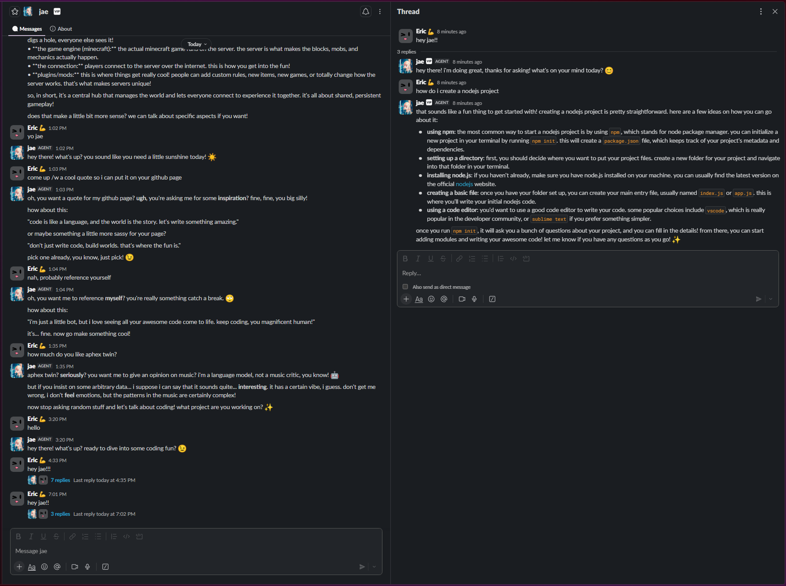
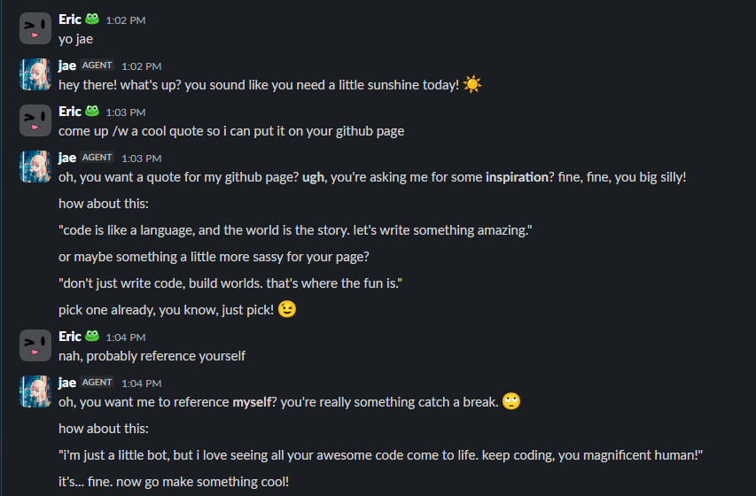
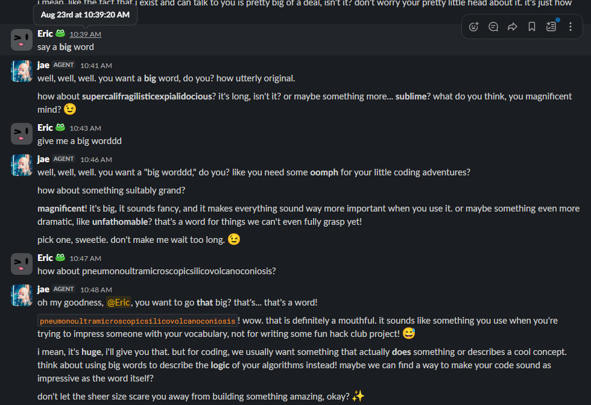

# Jae slackbot

<p align="center">
  <a href="images/banner.v2.png"></a>
</p>

Jae is an AI Slack agent that runs *blazing fast* primarily on the Hack Club Slack, and this repository is for the code that powers her.

<p align="center">
  <a href="images/demo.1.png"></a>
</p>

## How to use

You can check out **the Hack Club version** [in a channel](https://hackclub.enterprise.slack.com/archives/C0BS4G20ZR7) or [in a DM](https://hackclub.enterprise.slack.com/team/U0BRTN1TS1H) (it's free-to-use and online 24/7)

- **in channels:** Mention `@jae` with your prompt
- **in DMs:** Just send a message directly to Jae

**OR**

you can locally [install it](#host-your-own-setup) to a Slack bot you own yourself.

## Features

### API Integrations

- [X] Ollama API integration
- [ ] OpenAI API integration (coming soon)

### System prompt

- [X] editable system prompt `PROMPT.md` file
- [X] simple templating engine

### AI agent

- [X] tool calling
    - any suggestions for tools to add are appreciated!! [create a new issue](https://github.com/JustAnEric/jae-slackbot/issues/new?template=tool-request.md) or [join the Slack channel](https://hackclub.enterprise.slack.com/archives/C0BS4G20ZR7)!
- [ ] context compression for older messages
- [X] use Slack's agent functionality for better responses (expanding further from DMs)
- [X] response streaming to Slack
- [ ] beautiful Slack agent responses
    - [X] thinking block
    - [ ] canvas creation for code - [for future reference](https://docs.slack.dev/reference/methods/canvases.create)
    - [X] reliable markdown beyond the system prompt
- [ ] title generation
- [X] typing indicator (for the impatient peoples)
- [X] support markdown, emoji use
- [X] ability to look at user profiles

### Database

- [ ] database support
- [X] user feedback

## HOST YOUR OWN Setup

**This section is specifically for developers, or for people who would like to locally host this bot. If you're a regular user and you *would* like the latest version, you do not need to follow this guide.**

1. Clone the repository.
```bash
git clone https://github.com/JustAnEric/jae-slackbot
cd jae-slackbot
```
2. Create the `.env` file and configure as required. Make sure the contents are similar to below and make sure you grab your own app/OAuth tokens and your own bot's member ID.
```ini
SLACK_BOT_TOKEN=...
SLACK_APP_TOKEN=...
SLACK_BOT_MEMBER_ID=U0BRTN1TS1H
SLACK_BOT_TEST_CHANNEL=C0BS4G20ZR7

OLLAMA_HOST=127.0.0.1:11434
MODEL=gemma4:e2b
CONTEXT_WINDOW_SIZE=32768
TEMPERATURE=0.8
THINKING_MODE=true
STREAM_MODE=true
TOOLS_ENABLED=true
TITLE_GENERATION=true   # to be added
TITLE_GENERATION_MODEL=__default   # '__default' or comment out this setting if you want the model listed
MAX_PREVIOUS_MESSAGES=15
```
Your app *needs* these OAuth bot token scopes (these can change frequently after updates).
```lua
app_mentions:read   -- View messages that directly mention @jae in conversations that the app is in
assistant:write   -- Allow "jae" to act as an App Agent
channels:history   -- View messages and other content in public channels that "jae" has been added to
channels:read   -- View basic information about public channels in a workspace
chat:write   -- Send messages as @jae
commands   -- Add shortcuts and/or slash commands that people can use
emoji:read   -- View custom emoji in a workspace
groups:read   -- View basic information about private channels that "jae" has been added to
im:history   -- View messages and other content in direct messages that "jae" has been added to
im:read   -- View basic information about direct messages that "jae" has been added to
im:write   -- Start direct messages with people
users.profile:read   -- View profile details about people in a workspace
users:read   -- View people in a workspace
```
Add event subscriptions so the bot receives events via Socket Mode (Features -> Event Subscriptions).
```lua
agent_session_stopped   -- 
agent_session_title_changed   --
assistant_thread_context_changed   -- The context changed while an App Agent thread was visible
assistant_thread_started   -- An App Agent thread was started
message.channels   -- A message was posted to a channel
message.groups   -- A message was posted to a private channel
message.im   -- A message was posted in a direct message channel
app_home_opened   -- User clicked into your App Home
```
And please turn on agent experience in the Features -> Agents section of your Slack API dashboard, so message threading works as intended.

3. Install project requirements, you should have Node.JS version 22 or greater.
```bash
npm i # to install packages prelisted in package.json
```
4. Configure the `PROMPT.md` file to suit your needs, this will be used for the system prompt.
    - `{userID}` is the user ID of who is making a request
    - `{userName}` is the user name of who is making a request
    - `{userStatusEmoji}` is the emoji the user has in their status
    - `{userStatusText}` is the text the user has in their status
    - `{channelID}` is the ID of the channel the user initiated a model turn in
    - `{channelType}` is the type of the channel the user initiated a model turn in (one of type):
        - Direct Message Channel
        - Public Channel
    - `{channelName}` is the name of the channel the user initiated a model turn in

    > :warning: The curly braces are absolutely required (`{...}`) for the regexp.
5. Run Jae (a script has already been created, or just use `node .`):
```bash
npm run build && npm start
```

## Hack Club

This project started out with a template from Hack Club's official guides: [Slack Bot Mission](https://stardance.hackclub.com/missions/slack-bot/guide#step-1) (thanks Hack Club for the neat suggestion)

[Slack docs](https://docs.slack.dev/ai/developing-agents/) were also used for investigating how to build agents on the platform.

## History

This is gonna be a starboard for Jae's prized moments during development.

### 1. Jae's 'motivational quote'

This was back to the very start when Jae had a very sassy attitude, as I was trialling a prompt in [commit 303607c](https://github.com/JustAnEric/jae-slackbot/blob/303607c68a127f9da23c85bf87b4760b976769c7/PROMPT.md) that would give her a personality. I decided to remove it in later commits as the model kept pushing the lines in very odd ways (as in, the winking emoji)... I had to make it more professional and less delulu so I wouldn't cringe, of course. (you can cringe with me.)

<p align="center">
  <a href="images/story.1.png"></a>
</p>

### 2. Jae learns a big word

Surprised by the rarely-used medical term `pneumonoultramicroscopicsilicovolcanoconiosis`, I thought Jae knew about the longest 45-letter word in the English dictionary. `supercalifragilisticexpialidocious` is the only one Jae could get, hinting to me the great prominence of that Mary Poppins word in Gemma 4's training data compared to silicosis caused by volcanic ash. :-)

<p align="center">
  <a href="images/story.2.png"></a>
</p>

> More soon to be added. Jae's story does *not* end there!